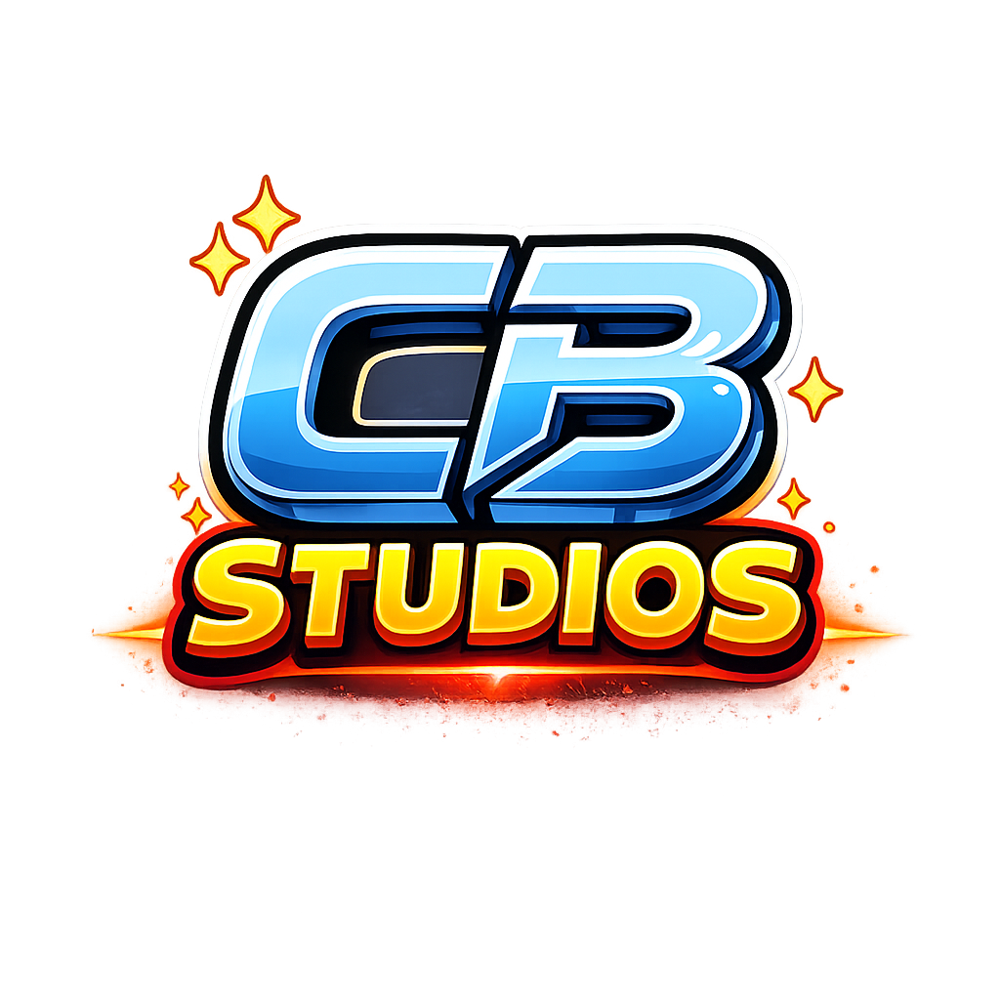
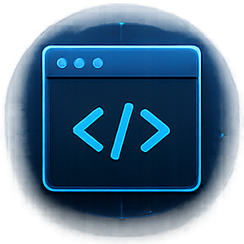
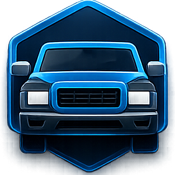
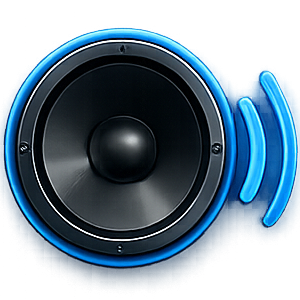
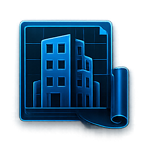
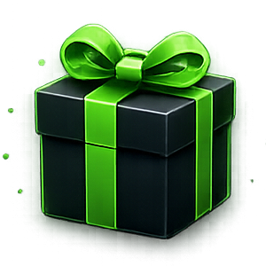

<section class="hub-hero">
  

    CB Studios Documentation Hub
    <h1>Premium FiveM & RedM Resources</h1>
    

      Official documentation for CB Studios resources: installation guides, compatibility notes,
      product references, support workflows, changelogs, and legal information for server owners
      and developers.
    

    

      <a class="docs-button docs-button--primary" href="#/products">Browse Products</a>
      <a class="docs-button" href="#/getting-started">View Documentation</a>
      <a class="docs-button docs-button--ghost" href="https://discord.gg/hsx6AvBg5s" target="_blank" rel="noopener noreferrer">Join Discord</a>
    

  

  

    
    

      <strong>CB Studios</strong>
      Product Documentation
    

  

</section>

<section class="value-strip" aria-label="CB Studios values">
  Professional Resources
  Performance Focused
  Regular Updates
  Dedicated Documentation
  FiveM & RedM Support
</section>

## Product Categories

  <a class="category-card" href="#/products?filter=scripts">
    
      
    
    <strong>Scripts</strong>
    
Gameplay systems, utilities, UI resources, and integrations documented for server deployment.

  </a>
  <a class="category-card" href="#/products?filter=vehicles">
    
      
    
    <strong>Vehicle Packs</strong>
    
Vehicle resources with installation, streaming, handling, and troubleshooting guidance.

  </a>
  <a class="category-card" href="#/products?filter=audio">
    
      
    
    <strong>Audio Packs</strong>
    
Sound resources documented with setup, testing, and compatibility notes.

  </a>
  <a class="category-card" href="#/products?filter=mlo">
    
      
    
    <strong>MLO / Mapping</strong>
    
Interior and mapping resources for roleplay environments.

  </a>
  <a class="category-card" href="#/products?filter=free">
    
      
    
    <strong>Free Resources</strong>
    
Publicly available resources with the same structured documentation standards.

  </a>

## Featured Resources

## Why CB Studios

  

    <strong>Clear installation documentation</strong>
    
Each documented resource is organized around setup, configuration, usage, troubleshooting, and support context.

  

  

    <strong>Compatibility information</strong>
    
Frameworks, dependencies, and integrations are listed from each resource page when that information is available.

  

  

    <strong>Organized support resources</strong>
    
Support, FAQ, troubleshooting, and Asset Escrow documentation are separated so customers can find the right path quickly.

  

  

    <strong>Product updates and changelogs</strong>
    
The changelog keeps release notes and compatibility changes separate from the homepage, so the homepage stays stable.

  

  

    <strong>Secure official purchase links</strong>
    
Official store references point to the CB Studios Tebex store and avoid outdated marketplace links.

  

## Support And Next Steps

<section class="support-cta">
  

    Need help?
    <h2>Start with the docs, then contact support with the right information.</h2>
    
Review requirements, installation steps, known problems, and Asset Escrow notes before opening a ticket.

  

  

    <a class="docs-button docs-button--primary" href="#/support">Support</a>
    <a class="docs-button" href="#/faq">FAQ</a>
    <a class="docs-button" href="#/problems">Troubleshooting</a>
    <a class="docs-button docs-button--ghost" href="https://pichirin-cb.tebex.io/" target="_blank" rel="noopener noreferrer">Tebex Store</a>
  

</section>
