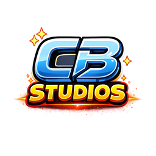
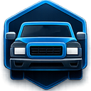

<section class="hub-hero">
  

    CB Studios Documentation Hub
    <h1>Build better roleplay experiences.</h1>
    

      Everything you need to install, configure, integrate, and maintain CB Studios resources for FiveM and RedM—organized for server owners and developers.
    

    

      <a class="docs-button docs-button--primary" href="#/products">Browse Products</a>
      <a class="docs-button" href="#/getting-started">Get Started</a>
      <a class="docs-button docs-button--ghost" href="https://discord.gg/hsx6AvBg5s" target="_blank" rel="noopener noreferrer">Join Discord</a>
      <a class="docs-button docs-button--ghost" href="https://github.com/Pichirin-CB?tab=repositories" target="_blank" rel="noopener noreferrer">View GitHub</a>
    

  

  

    

      
      

        <strong>CB Studios</strong>
        Official resource documentation
      

    

    

      
<strong>FiveM</strong><small>Scripts, vehicles, audio & mapping</small>

      
<strong>RedM</strong><small>Immersive gameplay resources</small>

      
<strong>Support</strong><small>Guides, troubleshooting & updates</small>

    

  

</section>

<section class="value-strip" aria-label="CB Studios values">
  Official Documentation
  FiveM & RedM
  Clear Installation
  Developer References
  Dedicated Support
</section>

## Start Here

  <a class="journey-card" href="#/getting-started">
    01
    
<strong>Choose your resource</strong>
Review requirements, frameworks, and dependencies before installation.

  </a>
  <a class="journey-card" href="#/guides/installation">
    02
    
<strong>Install with confidence</strong>
Follow the recommended deployment order and verify each step.

  </a>
  <a class="journey-card" href="#/support">
    03
    
<strong>Get the right support</strong>
Use troubleshooting first, then contact us with the required details.

  </a>

## Product Categories

  <a class="category-card" href="#/products?filter=scripts">
    
      
    
    <strong>Scripts</strong>
    
Gameplay systems, utilities, UI resources, and integrations documented for server deployment.

  </a>
  <a class="category-card" href="#/products?filter=vehicles">
    
      
    
    <strong>Vehicle Packs</strong>
    
Vehicle resources with installation, streaming, handling, and troubleshooting guidance.

  </a>
  <a class="category-card" href="#/products?filter=audio">
    
      
    
    <strong>Audio Packs</strong>
    
Sound resources documented with setup, testing, and compatibility notes.

  </a>
  <a class="category-card" href="#/products?filter=mlo">
    
      
    
    <strong>MLO / Mapping</strong>
    
Interior and mapping resources for roleplay environments.

  </a>
  <a class="category-card" href="#/products?filter=free">
    
      
    
    <strong>Free Resources</strong>
    
Publicly available resources with the same structured documentation standards.

  </a>

## Featured Resources

## Documentation You Can Use

  

    01<strong>Practical installation</strong>
    
Requirements, start order, configuration, verification, and update steps in one predictable structure.

  

  

    02<strong>Verified compatibility</strong>
    
Frameworks, dependencies, and integrations are documented from the actual resource information.

  

  

    03<strong>Faster troubleshooting</strong>
    
Common failures, Asset Escrow guidance, and support requirements are easy to find and act on.

  

  

    04<strong>Transparent updates</strong>
    
Release notes keep changes and compatibility information separate from evergreen documentation.

  

  

    05<strong>Official channels</strong>
    
Store, GitHub, Discord, support, and legal references stay connected to the verified CB Studios channels.

  

## Support And Next Steps

<section class="support-cta">
  

    Need help?
    <h2>Start with the docs, then contact support with the right information.</h2>
    
Review requirements, installation steps, known problems, and Asset Escrow notes before opening a ticket.

  

  

    <a class="docs-button docs-button--primary" href="#/support">Support</a>
    <a class="docs-button" href="#/faq">FAQ</a>
    <a class="docs-button" href="#/problems">Troubleshooting</a>
    <a class="docs-button docs-button--ghost" href="https://github.com/Pichirin-CB?tab=repositories" target="_blank" rel="noopener noreferrer">GitHub</a>
    <a class="docs-button docs-button--ghost" href="https://pichirin-cb.tebex.io/" target="_blank" rel="noopener noreferrer">Tebex Store</a>
  

</section>
